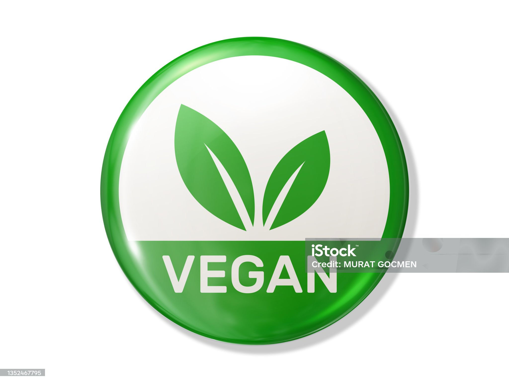

<!-- Improved compatibility of back to top link: See: https://github.com/othneildrew/Best-README-Template/pull/73 -->
<a name="readme-top"></a>
<!--
*** Thanks for checking out the Best-README-Template. If you have a suggestion
*** that would make this better, please fork the repo and create a pull request
*** or simply open an issue with the tag "enhancement".
*** Don't forget to give the project a star!
*** Thanks again! Now go create something AMAZING! :D
-->


<!-- PROJECT SHIELDS -->
<!--
*** I'm using markdown "reference style" links for readability.
*** Reference links are enclosed in brackets [ ] instead of parentheses ( ).
*** See the bottom of this document for the declaration of the reference variables
*** for contributors-url, forks-url, etc. This is an optional, concise syntax you may use.
*** https://www.markdownguide.org/basic-syntax/#reference-style-links
-->
[![Contributors][contributors-shield]][contributors-url]
[![Forks][forks-shield]][forks-url]
[![Stargazers][stars-shield]][stars-url]
[![Issues][issues-shield]][issues-url]
[![MIT License][license-shield]][license-url]
[![LinkedIn][linkedin-shield]][linkedin-url]


<!-- PROJECT LOGO -->
<br />
<div align="center">
  <a href="https://github.com/GiuLuongoCode/veganly">
    
  </a>

<h3 align="center">Veganly</h3>

  <p align="center">
    An app to find the vegan recipes
    <br />
    <a href="https://github.com/GiuLuongoCode/veganly"><strong>Explore the project »</strong></a>
    <br />
    <br />
    <a href="https://veganly.netlify.app/">View Demo</a>
    ·
    <a href="https://github.com/GiuLuongoCode/veganly/issues">Report Bug</a>
    ·
    <a href="https://github.com/GiuLuongoCode/veganly/issues">Request Feature</a>
  </p>
</div>


<!-- TABLE OF CONTENTS -->
<details>
  <summary>Table of Contents</summary>
  <ol>
    <li>
      <a href="#about-the-project">About The Project</a>
      <ul>
        <li><a href="#built-with">Built With</a></li>
      </ul>
    </li>
    <li>
      <a href="#getting-started">Getting Started</a>
      <ul>
        <li><a href="#prerequisites">Prerequisites</a></li>
        <li><a href="#installation">Installation</a></li>
      </ul>
    </li>
    <li><a href="#usage">Usage</a></li>
    <li><a href="#File Structure">File Structure</a></li>
    <li><a href="#roadmap">Roadmap</a></li>
    <li><a href="#contributing">Contributing</a></li>
    <li><a href="#license">License</a></li>
    <li><a href="#contact">Contact</a></li>
    <li><a href="#acknowledgments">Acknowledgments</a></li>
  </ol>
</details>


<!-- ABOUT THE PROJECT -->
## About The Project

[![Product Name Screen Shot][product-screenshot]]()

Veganly is a web application that provides a user-friendly platform for discovering a wide variety of delicious and nutritious vegan recipes. Whether you're a dedicated vegan or simply exploring plant-based options, this app is your go-to source for flavorful and satisfying meals.

<p align="right">(<a href="#readme-top">back to top</a>)</p>


### Built With

* [![Javascript]][Javascript]
* [![React][React]][React-url]
* [![Axios][Axios]][Axios-url]
* [![Tailwind][Tailwind]][Tailwind-url]
<p align="right">(<a href="#readme-top">back to top</a>)</p>


<!-- GETTING STARTED -->
## Getting Started

To get a local copy up and running follow these simple example steps.

### Prerequisites
You must have installed npm. To do this run the following command in a terminal.
* npm
  ```sh
  npm install npm@latest -g
  ```

### Installation

1. Clone the repo
   ```sh
   git clone https://github.com/GiuLuongoCode/veganly.git
   ```
2. Install NPM packages
   ```sh
   npm install
   ```
3. Configure enviroment variables
    3.1. Create a '.env' file in the project root and add your API endpoint of Teleport. See '.env.example' file for more details.
   ```js
   VITE_API_KEY = 'YOUR API_KEY'
   VITE_API_URL = 'API TO OBTAIN THE RECIPE'
   VITE_BASE_API_RECIPE_DETAIL = 'BASE URL API TO OBTAIN INFORMATION ABOUT A RECIPE'
   VITE_API_RECIPE_DETAIL='API TO OBTAIN INFORMATION ABOUT A RECIPE'
   ```
4. Build the project
    ```sh
    npm run build
    ```
5. Run the application
    ```sh
    npm run dev
    ```

<p align="right">(<a href="#readme-top">back to top</a>)</p>


<!-- USAGE EXAMPLES -->
## Usage

Once the application is started, the following screen will appear. Use the search bar to find recipes and press the search button to retrieve all possible recipes. All retrieved recipes will be displayed in a card grid, where the title and image of the recipe appear. You can click on a card and it will open a page containing the recipe information.


<p align="right">(<a href="#readme-top">back to top</a>)</p>

## File Structure
The application repository is structured as follows:
```
veganly-app/
  ├── package.json
  ├── package-lock.json
  ├── postcss.config.json
  ├── vite.config.json
  ├── index.html
  ├── tailwind.config.json
  ├── public/
  │   └── readme/screenshot.png
  │   └── veganly.jpg
  ├── src
  │   └── actions/
  │   └── components/
  │   └── pages/
  │   └── reducers/
  │   └── store/
  │   └── App.css
  │   └── App.jsx
  │   └── index.css
  │   └── main.jsx
  └── 

 ```
* package.json contains the npm packages to install.
* postcss.config.json contains the settings to build css with Tailwind.
* tailwind.config.json contains the settings for Tailwind.
* vite.config.json contains the settings for Vite.
* src/main.jsx contains the main code.
* src/index.css contains the main CSS.
* src/App.css contains the main CSS of the component App.
* src/App.jsx contains the main component of the app.
* src/components/ contains the React functional component that handle the component of UI.
* src/pages/ contains the pages of the app.
* src/reducers/ contains the reducers of the app.
* src/actions/ contains the actions of the app.
* src/store/ contains the logic for the store of the app.
* index.html contains the main HTML code.
* public/ contains the icons.

<p align="right">(<a href="#readme-top">back to top</a>)</p>


<!-- CONTRIBUTING -->
## Contributing

Contributions are what make the open source community such an amazing place to learn, inspire, and create. Any contributions you make are **greatly appreciated**.

If you have a suggestion that would make this better, please fork the repo and create a pull request. You can also simply open an issue with the tag "enhancement".
Don't forget to give the project a star! Thanks again!

1. Fork the Project
2. Create your Feature Branch (`git checkout -b feature/AmazingFeature`)
3. Commit your Changes (`git commit -m 'Add some AmazingFeature'`)
4. Push to the Branch (`git push origin feature/AmazingFeature`)
5. Open a Pull Request

<p align="right">(<a href="#readme-top">back to top</a>)</p>


<!-- CONTACT -->
## Contact

[@GiuLuongoCode](![[Github]][Github-url]) - ![Github]

Project Link: [https://github.com/GiuLuongoCode/veganly](https://github.com/GiuLuongoCode/veganly)

<p align="right">(<a href="#readme-top">back to top</a>)</p>


<!-- MARKDOWN LINKS & IMAGES -->
<!-- https://www.markdownguide.org/basic-syntax/#reference-style-links -->
[contributors-shield]: https://img.shields.io/github/contributors/github_username/repo_name.svg?style=for-the-badge
[contributors-url]: https://github.com/GiuLuongoCode/veganly/contributors
[forks-shield]: https://img.shields.io/github/forks/github_username/repo_name.svg?style=for-the-badge
[forks-url]: https://github.com/GiuLuongoCode/veganly/network/members
[stars-shield]: https://img.shields.io/github/stars/github_username/repo_name.svg?style=for-the-badge
[stars-url]: https://github.com/GiuLuongoCode/veganly/stargazers
[issues-shield]: https://img.shields.io/github/issues/github_username/repo_name.svg?style=for-the-badge
[issues-url]: https://github.com/GiuLuongoCode/veganly/issues
[license-shield]: https://img.shields.io/github/license/github_username/repo_name.svg?style=for-the-badge
[license-url]: https://github.com/GiuLuongoCode/veganly/blob/master/LICENSE.txt
[linkedin-shield]: https://img.shields.io/badge/-LinkedIn-black.svg?style=for-the-badge&logo=linkedin&colorB=555
[linkedin-url]: https://linkedin.com/in/linkedin_username
[product-screenshot]: /veganly-app/public/readme/screenshot.png
[Javascript]: https://img.shields.io/badge/JavaScript-323330?style=for-the-badge&logo=javascript&logoColor=F7DF1E
[React]: 	https://img.shields.io/badge/React-20232A?style=for-the-badge&logo=react&logoColor=61DAFB
[React-url]: https://react.dev/ 
[Axios]: https://img.shields.io/badge/axios-671ddf?&style=for-the-badge&logo=axios&logoColor=white
[Axios-url]: https://axios-http.com/docs/intro
[Github]: https://img.shields.io/badge/GitHub-100000?style=for-the-badge&logo=github&logoColor=white
[Github-url]: https://github.com/GiuLuongoCode
[Tailwind]: https://img.shields.io/badge/Tailwind_CSS-38B2AC?style=for-the-badge&logo=tailwind-css&logoColor=white
[Tailwind-url]: https://tailwindcss.com/
